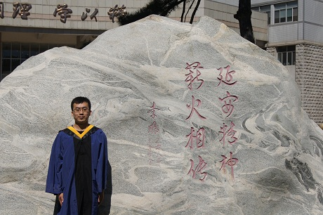

<head>
<meta http-equiv="Content-Type" content="text/html; charset=utf-8" />
<link rel="stylesheet" type="text/css" media="all" href="style.css">

<title>刘旭东的个人主页</title>

</head>

<body>

 

<h2>我的博文：</h2> 
<ul> 
<li>24 Dec 2014 >> <a href="/statistic/2014/12/28/markov">马尔科夫链</a></li>
<li>24 Dec 2014 >> <a href="http://www.cnblogs.com/retarded/articles/4129413.html">EM算法介绍</a></li>
</ul>

</body>

